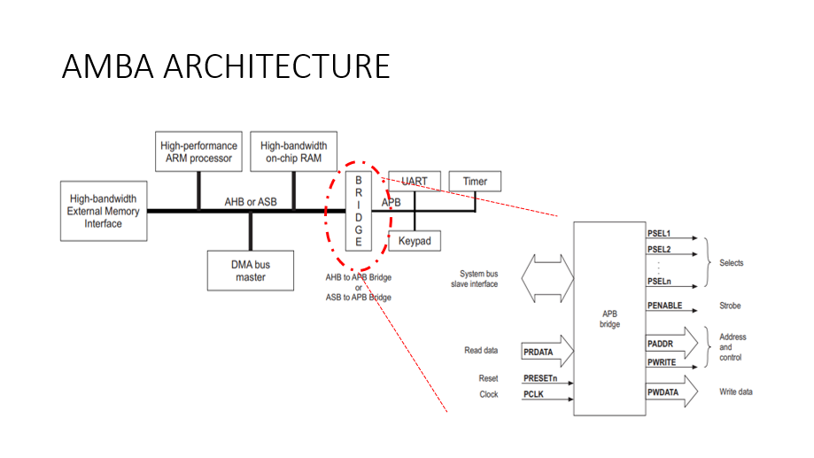
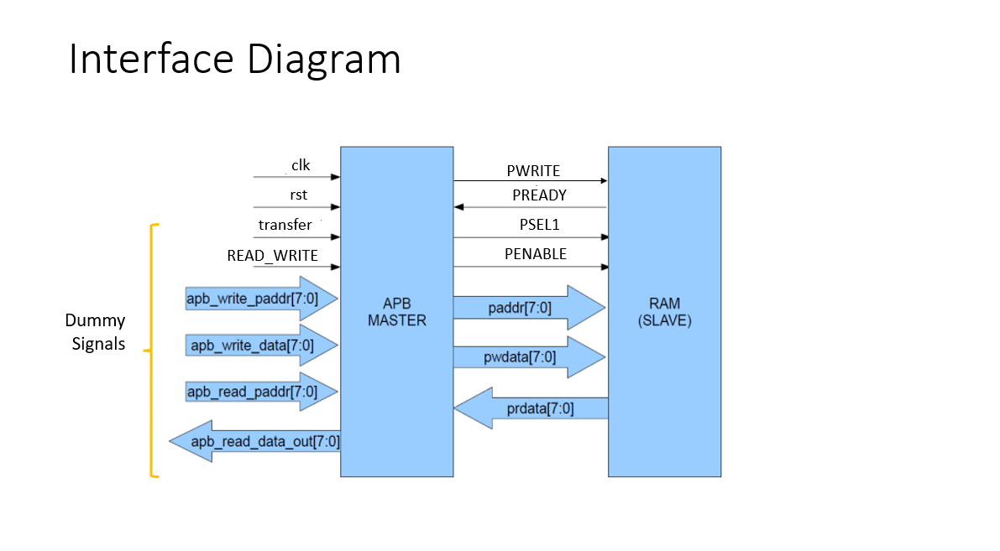
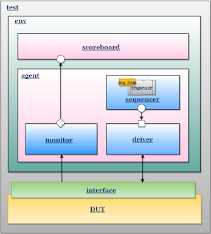
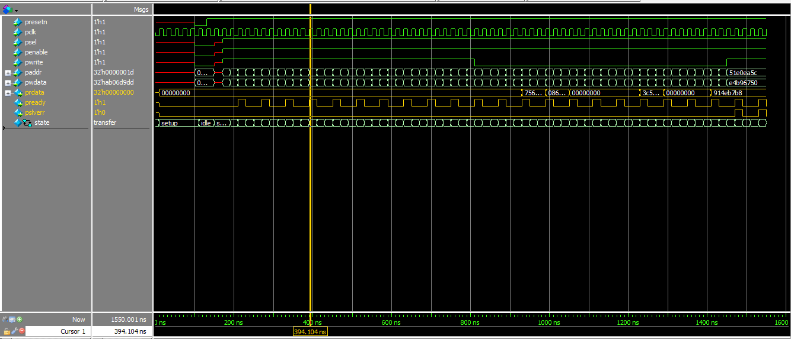
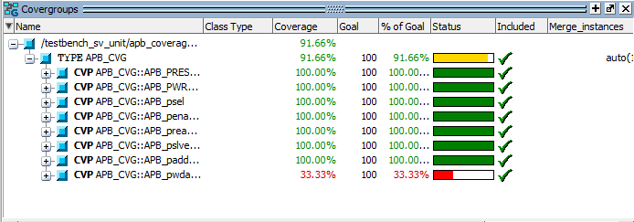
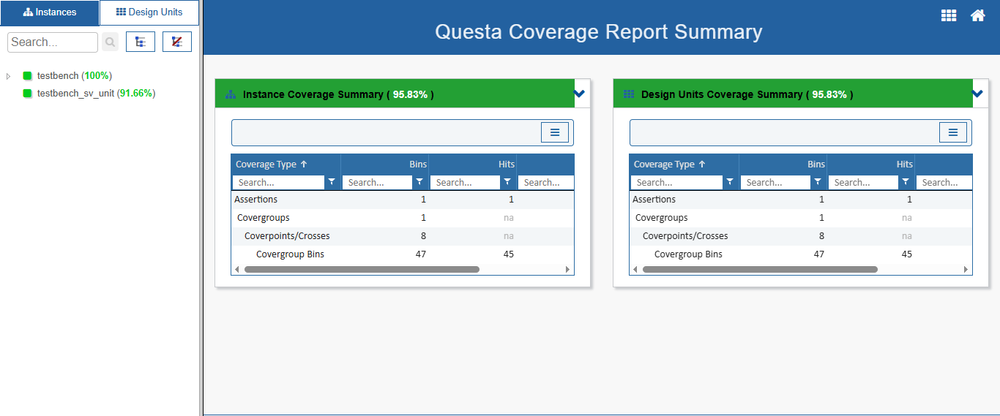

# Design and Verification using UVM for APB Protocol 

## 1. Directories:
- rtl               : rtl design.
- tb/top            : hvl top.
- tb/test           : tests.
- tb/env            : Environment, scoreboard ...
- tb/agents         : agents.
- tb/sequences      : sequences.

## 2. AMBA Architecture:
Open standard to connect and manage functional blocks in a system-on-chip (SoC)

## 3. Interface Diagram:

## 4. Interface signals:
| Signal name   | Signal width      | Description                      
| ------------- | ----------------- | -----------------------------------------------------------                                        
| presetn       | Bit               | Active low reset signal.                  
| pclk          | Bit               | Clock signal on which the entire module is working.
| psel          | Bit               | 
| penable       | Bit               | 
| pwrite        | Bit               | 
| paddr         | [31:0]            | 
| pwdata        | [31:0]            | 
| prdata        | [31:0]            | 
| pready        | Bit               | 
| pslverr       | Bit               | 

## 5. UVM Architecture:

## 6. Sequence items:
apb_seq_item

## 7. Sequences:

| Sequence               |
| ---------------------- |
| apb_reset_sequence     |
| apb_write_sequence     |
| apb_error_sequence     |
| apb_read_sequence      |

## 8. Tests Scenarios:
| Test               | Scenario                                                                                  |
| ------------------ | ----------------------------------------------------------------------------------------- |
| apb_test_all	     | reset -> write -> read -> error

### Test all 

## 9. Coverage:

